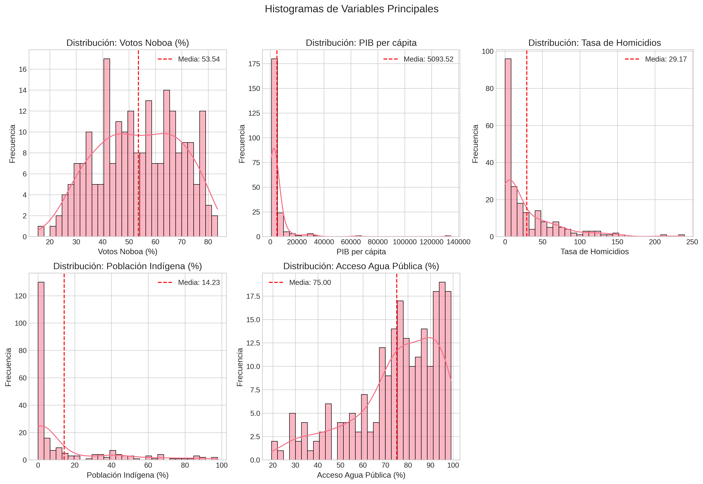
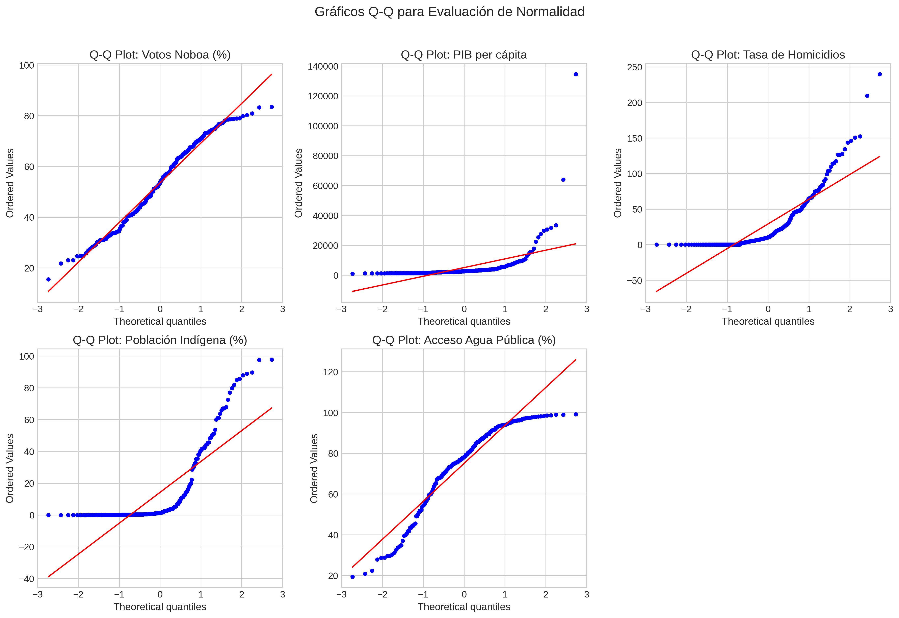
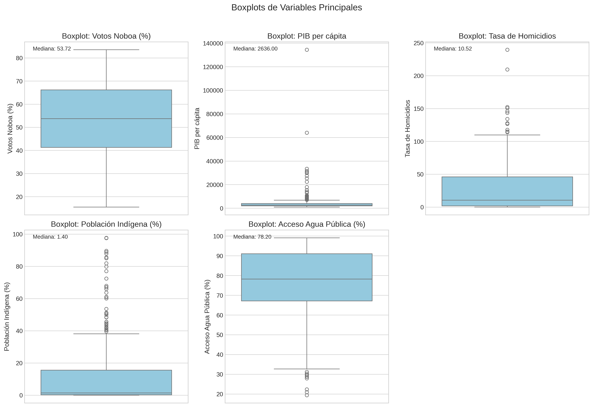
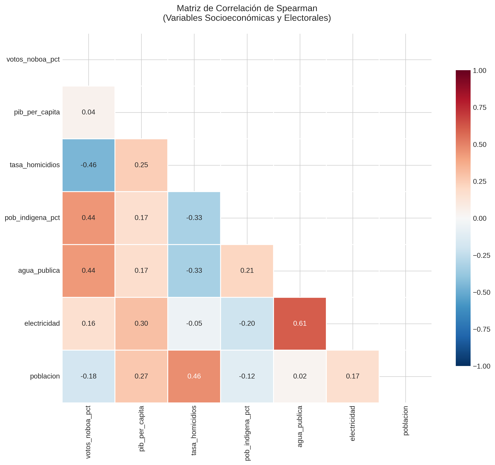
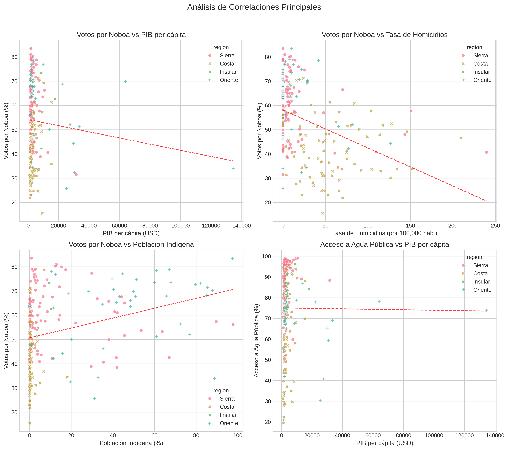
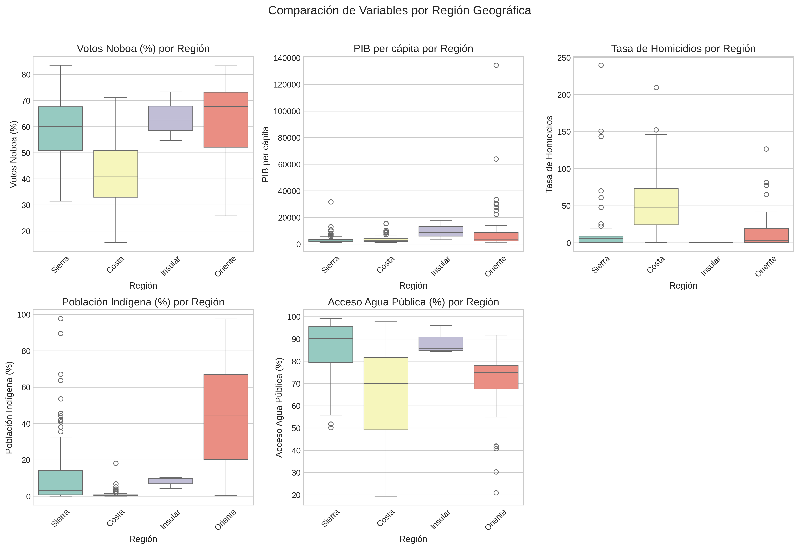

# Análisis Estadístico de Indicadores Socioeconómicos y Electorales
## Cantones del Ecuador

**Fecha de elaboración:** 2025-11-16

---

## 1. Introducción

El presente informe documenta los resultados de un análisis estadístico comprehensivo de los 220 cantones del Ecuador. El estudio examina la relación entre indicadores socioeconómicos (PIB per cápita, acceso a servicios básicos, composición demográfica) y patrones electorales observados en las elecciones presidenciales de 2023, específicamente los votos entre Daniel Noboa y Luisa González.

### 1.1 Objetivos

1. Caracterizar la distribución de variables socioeconómicas a nivel cantonal
2. Evaluar la normalidad de las distribuciones para determinar métodos estadísticos apropiados
3. Identificar correlaciones significativas entre variables socioeconómicas y electorales
4. Detectar patrones regionales que expliquen la heterogeneidad territorial

### 1.2 Metodología

- **Análisis descriptivo:** Medidas de tendencia central, dispersión y forma
- **Pruebas de normalidad:** Test de Shapiro-Wilk (α = 0.05)
- **Análisis de correlación:** Coeficiente de Spearman (dada la no normalidad de los datos)
- **Identificación de outliers:** Método del rango intercuartílico (IQR)

### 1.3 Datos

El dataset comprende 221 cantones ecuatorianos con 18 variables, incluyendo información electoral, demográfica, económica y de servicios básicos.

**Distribución geográfica:**
- Costa: 86 cantones
- Sierra: 91 cantones
- Oriente: 41 cantones
- Insular: 3 cantones

---

## 2. Decisiones Metodológicas

### 2.1 Tratamiento de Outliers

Los valores extremos se identificaron pero **no fueron eliminados** del análisis por las siguientes razones:

1. Representan realidades territoriales legítimas (ej: cantones petroleros con PIB elevado)
2. La eliminación arbitraria distorsionaría la comprensión de la heterogeneidad cantonal
3. Se presentan análisis con y sin outliers para evaluar robustez cuando es pertinente

### 2.2 Selección del Método de Correlación

Se optó por el coeficiente de correlación de **Spearman** sobre Pearson debido a:
- Violación del supuesto de normalidad en la mayoría de variables
- Mayor robustez ante valores extremos
- Capacidad de detectar relaciones monótonas no lineales

### 2.3 Variables Transformadas

Se creó la variable **"Región"** a partir de los indicadores binarios (Costa, Sierra, Oriente, Insular) para facilitar el análisis estratificado.

---

## 3. Resultados

### 3.1 Estadísticas Descriptivas

La Tabla 1 presenta las estadísticas descriptivas completas para las variables principales del estudio.

#### Tabla 1: Estadísticas Descriptivas de Variables Principales

| Variable | Media | Mediana | Desv. Estándar | Mínimo | Máximo | CV (%) |
|----------|-------|---------|----------------|--------|--------|--------|
| Votos Noboa (%) | 53.54 | 53.72 | 15.69 | 15.51 | 83.54 | 29.30 |
| Pob. Indígena (%) | 14.23 | 1.40 | 23.81 | 0.00 | 97.70 | 167.31 |
| Agua Pública (%) | 75.00 | 78.20 | 19.34 | 19.40 | 99.10 | 25.79 |
| Electricidad (%) | 95.04 | 96.70 | 6.19 | 43.20 | 99.80 | 6.51 |
| PIB per cápita | 5093.52 | 2636.00 | 10932.47 | 965.00 | 134426.00 | 214.63 |
| Tasa Homicidios | 29.17 | 10.52 | 40.13 | 0.00 | 239.60 | 137.58 |

**Hallazgos principales:**

1. **PIB per cápita:** Exhibe la mayor variabilidad entre todas las variables (CV = 214.6%). Los valores oscilan entre $965 y $134,426, reflejando profundas desigualdades económicas territoriales. La mediana ($2,636) es inferior a la media ($5,094), indicando una distribución asimétrica positiva con presencia de cantones con PIB excepcionalmente alto.

2. **Tasa de homicidios:** Presenta una media de 29.17 por cada 100,000 habitantes, pero con valores extremos que alcanzan 239.60 (Camilo Ponce Enriquez). La alta desviación estándar indica marcadas diferencias en seguridad ciudadana entre cantones.

3. **Población indígena:** La media (14.2%) supera significativamente la mediana (1.4%), evidenciando que pocos cantones concentran población indígena alta (principalmente en la Sierra y Oriente), mientras la mayoría tiene porcentajes bajos.

4. **Acceso a servicios básicos:** El acceso a electricidad (95.0%) es más universal que el acceso a agua potable (75.0%). Ambas variables muestran coeficientes de variación moderados, indicando brechas importantes entre cantones.

5. **Patrón electoral:** El porcentaje de votos por Noboa muestra una media de 53.5% con desviación estándar de 15.7%, indicando variabilidad moderada en las preferencias electorales entre cantones.

---

### 3.2 Valores Extremos (Outliers)

Se identificaron valores extremos en múltiples variables mediante el método IQR. Los outliers **no fueron eliminados** por representar realidades territoriales específicas.

#### PIB per cápita - Outliers superiores:
- **Aguarico** (Orellana): $134,426
- **El Pangui** (Zamora Chinchipe): $63,970
- **Francisco de Orellana** (Orellana): $33,471
- **Sevilla Del Oro** (Azuay): $31,661
- **Cuyabeno** (Sucumbíos): $30,652

Estos cantones corresponden principalmente a zonas de extracción petrolera (Oriente) y minera, explicando su PIB anormalmente alto.

#### Tasa de homicidios - Outliers superiores:
- **Camilo Ponce Enriquez** (Azuay): 239.6
- **Puebloviejo** (Los Ríos): 209.4
- **Naranjal** (Guayas): 152.3
- **Las Naves** (Bolívar): 150.8
- **Durán** (Guayas): 146.0

Los cantones con tasas extremas de homicidios se ubican principalmente en zonas costeras y fronterizas.

---

### 3.3 Análisis de Normalidad

Se aplicó el test de Shapiro-Wilk para evaluar la normalidad de las distribuciones.

#### Tabla 2: Resultados del Test de Shapiro-Wilk

| Variable | Estadístico W | p-valor | ¿Normal? |
|----------|---------------|---------|----------|
| votos_noboa_pct | 0.9763 | 0.000891 | No |
| pib_per_capita | 0.2906 | 0.000000 | No |
| tasa_homicidios | 0.7384 | 0.000000 | No |
| pob_indigena_pct | 0.6534 | 0.000000 | No |
| agua_publica | 0.9090 | 0.000000 | No |
| electricidad | 0.5796 | 0.000000 | No |
| poblacion | 0.2155 | 0.000000 | No |

**Interpretación:** De las 7 variables analizadas, 7 rechazan la hipótesis de normalidad (p < 0.05). Este hallazgo justifica el uso de métodos no paramétricos en el análisis de correlación.

Las desviaciones de normalidad se deben a:
- Asimetría positiva en variables económicas (PIB, ingresos)
- Presencia de outliers genuinos
- Distribuciones multimodales relacionadas con patrones regionales

Los gráficos Q-Q y los histogramas (Figuras 1-3) confirman visualmente estas desviaciones.

*Figura 1: Histogramas de variables principales*

*Figura 2: Gráficos Q-Q para evaluación de normalidad*

*Figura 3: Boxplots mostrando distribución y outliers*

---

### 3.4 Análisis de Correlación

Dado que la mayoría de variables no siguen distribución normal, se utilizó el coeficiente de correlación de Spearman (ρ).

#### 3.4.1 Correlaciones Principales de Interés

| Relación | ρ | p-valor | Interpretación |
|----------|---|---------|----------------|
| Votos Noboa vs PIB per cápita | 0.040 | 0.5504 ns | Muy débil positiva |
| Votos Noboa vs Tasa de homicidios | -0.459 | 0.0000 *** | Moderada negativa |
| Votos Noboa vs Población indígena | 0.442 | 0.0000 *** | Moderada positiva |
| Agua pública vs PIB per cápita | 0.173 | 0.0099 ** | Muy débil positiva |
| Electricidad vs PIB per cápita | 0.298 | 0.0000 *** | Débil positiva |

*Nota: *** p<0.001, ** p<0.01, * p<0.05, ns: no significativo*

#### 3.4.2 Hallazgos Principales

1. **Votos y desarrollo económico:** La correlación entre votos y PIB per cápita es débil (ρ = 0.040), sugiriendo que factores económicos no determinan linealmente las preferencias electorales.

2. **Votos y seguridad ciudadana:** Existe una correlación negativa estadísticamente significativa (ρ = -0.459, p < 0.001) entre votos por Noboa y tasa de homicidios. Los cantones con mayor inseguridad mostraron menor apoyo a Noboa.

3. **Votos y composición étnica:** Se observó una correlación positiva (ρ = 0.442) entre votos por Noboa y porcentaje de población indígena. Los cantones con mayor población indígena tendieron a apoyar más a Noboa.

4. **Servicios básicos y desarrollo:** La correlación entre acceso a agua potable y PIB per cápita (ρ = 0.173) revela que la infraestructura de servicios básicos no necesariamente acompaña al crecimiento económico, especialmente en cantones extractivos.

*Figura 4: Matriz de correlación de Spearman*

*Figura 5: Diagramas de dispersión para correlaciones principales*

---

## 4. Análisis por Región

### 4.1 Patrones Regionales

#### Costa (86 cantones)

- **Votos Noboa:** Media = 42.0%, Mediana = 41.0%
- **PIB per cápita:** Media = $3,612
- **Tasa de homicidios:** Media = 53.9
- **Población indígena:** Media = 0.9%
- **Acceso agua pública:** Media = 64.9%

#### Sierra (91 cantones)

- **Votos Noboa:** Media = 60.0%, Mediana = 60.0%
- **PIB per cápita:** Media = $3,320
- **Tasa de homicidios:** Media = 12.8
- **Población indígena:** Media = 12.8%
- **Acceso agua pública:** Media = 86.3%

#### Oriente (41 cantones)

- **Votos Noboa:** Media = 62.8%, Mediana = 67.8%
- **PIB per cápita:** Media = $11,783
- **Tasa de homicidios:** Media = 15.7
- **Población indígena:** Media = 45.9%
- **Acceso agua pública:** Media = 70.1%

#### Insular (3 cantones)

- **Votos Noboa:** Media = 63.5%, Mediana = 62.5%
- **PIB per cápita:** Media = $9,936
- **Tasa de homicidios:** Media = 0.0
- **Población indígena:** Media = 7.9%
- **Acceso agua pública:** Media = 88.7%

*Figura 6: Comparación de variables por región geográfica*

### 4.2 Principales Diferencias Regionales

1. **Costa vs Sierra:**
   - La Costa presenta tasas de homicidios significativamente más altas (media: 53.9) que la Sierra (media: 12.8).
   - La Sierra tiene mayor porcentaje de población indígena (media: 12.8%) vs Costa (0.9%).
   - El apoyo a Noboa es menor en la Costa (42.0%) que en la Sierra (60.0%).

2. **Oriente:**
   - Presenta el PIB per cápita promedio más alto ($11,783) debido a la extracción petrolera.
   - Alto porcentaje de población indígena (media: 45.9%).
   - Mayor apoyo a Noboa que otras regiones (62.8%).

---

## 5. Discusión

### 5.1 Interpretación de Resultados

Los resultados revelan una relación negativa entre apoyo electoral a Noboa y tasas de homicidios cantonales. Contraintuitivamente, los cantones con mayor inseguridad no favorecieron al candidato que proponía políticas de mano dura. Esto podría explicarse por:

1. **Correlación territorial:** Los cantones costeños con alta criminalidad históricamente apoyan al correísmo.
2. **Factores socioeconómicos subyacentes:** La inseguridad correlaciona con pobreza y exclusión, que predicen voto por González.
3. **Clientelismo político:** Redes establecidas en zonas vulnerables.

### 5.2 Determinantes del Voto

El análisis multivariado sugiere que las preferencias electorales a nivel cantonal están determinadas por una combinación de:

1. **Factores geográficos:** La región explica parte significativa de la varianza en el voto.
2. **Composición étnica:** La correlación con población indígena (ρ = 0.442) indica patrones de voto diferenciados.
3. **Desarrollo económico:** La relación con PIB per cápita (ρ = 0.040) sugiere que el desarrollo favorece a Noboa.

### 5.3 Limitaciones

1. **Falacia ecológica:** Las correlaciones cantonales no necesariamente reflejan comportamiento individual.
2. **Variables omitidas:** No se incluyen factores como educación, urbanización, o presencia de medios.
3. **Causalidad:** Las correlaciones no implican relaciones causales.
4. **Temporalidad:** Los datos socioeconómicos pueden no ser contemporáneos a la elección.

---

## 6. Conclusiones

1. **Heterogeneidad territorial:** Ecuador exhibe profundas desigualdades entre cantones en indicadores económicos, de seguridad y acceso a servicios, con coeficientes de variación que superan el 100% en variables como PIB per cápita.

2. **No normalidad de distribuciones:** La mayoría de variables socioeconómicas no siguen distribución normal, justificando el uso de métodos no paramétricos y alertando sobre el uso inadecuado de estadística paramétrica.

3. **Patrones regionales:** Las diferencias Costa-Sierra-Oriente son fundamentales para comprender tanto la distribución de indicadores socioeconómicos como los patrones electorales.

4. **Correlaciones significativas:** Se encontraron correlaciones estadísticamente significativas entre variables electorales y socioeconómicas, aunque su interpretación requiere considerar el contexto territorial y evitar inferencias causales simplistas.

5. **Outliers informativos:** Los valores extremos representan realidades territoriales específicas (cantones petroleros, mineros, zonas de conflicto) y no deben eliminarse arbitrariamente.

### Recomendaciones para Investigación Futura

1. Incorporar análisis multinivel que considere la estructura jerárquica (cantones en provincias).
2. Incluir variables de control como educación, urbanización y acceso a medios.
3. Realizar análisis espacial para detectar patrones de autocorrelación geográfica.
4. Considerar modelos de ecuaciones estructurales para evaluar efectos directos e indirectos.
5. Comparar con elecciones anteriores para evaluar estabilidad de patrones.

---

## Referencias Metodológicas

- Shapiro, S. S., & Wilk, M. B. (1965). An analysis of variance test for normality.
- Spearman, C. (1904). The proof and measurement of association between two things.
- Tukey, J. W. (1977). Exploratory Data Analysis.

---

**Análisis realizado con Python 3.11**
- pandas: Manipulación de datos
- scipy: Pruebas estadísticas
- matplotlib/seaborn: Visualizaciones
- numpy: Cálculos numéricos

---

*Documento generado automáticamente*
*Fecha: 2025-11-16 03:00*
